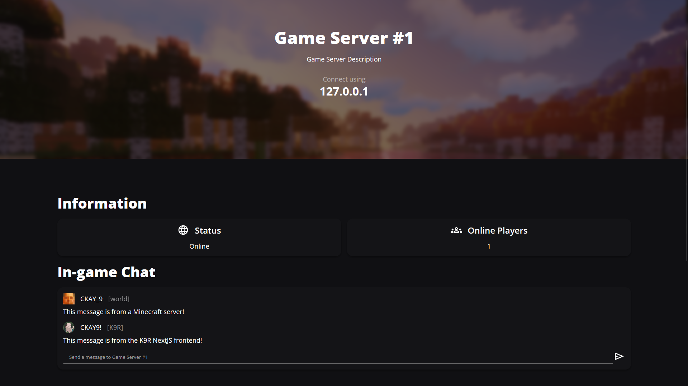

    

An absolute overhaul to K9-Forums. K9-Revive.

## What is K9-Revive

    

K9-Revive (K9R) is a spiritual successor to my previous project <a href="https://github.com/CKAY-9/k9-forums">K9-Forums</a>. K9-Forums was, as I decided with many other projects, poorly structured, not what I would want to have out there, and not complete.

K9R is ultimately my first major revision of one of projects, with more likely to come (they have been deleted off of GitHub), and will hopefully be great; however, K9-Forums will remain on GitHub as it is in a "usable" state and as a look back into my coding history.

## So, What's Different?

    

Compared to K9-Forums, K9R is more than just a forum. K9R does offer an improved version of K9-Forums within it; however
it also contains game integration, real-time chat, functionality for usergroups, and more.

## Features

### Forums

    

K9R, being based off of K9-Forums, comes with an easy to setup forum. Management is done through the admin panel and offer many quality of life
features.

### Usergroups

    

K9R allows you to easily configure different usergroups and permissions through the admin panel. You can add users to different usergroups through the users tab.

### Game Integration

    
    

K9R, also being inspired by CxDashboard, comes with simple game mods/plugins for real-time websocket communication with K9R. These are used for real-time statistics, chat, commands, and fetching data from the K9R API.

### Self-Hosted
K9R is meant to be self-hosted and isn't tied to any specific server or host. This allows you to setup K9R in whatever way you want.

## How to use

This will go over how to create a local enviornment. This will not show how to setup a dedicated server.

### Frontend
1. Setup your enviornment variables, see .env.example
2. Run `npm install`
3. Run `npm run build`
4. Run `npm run start`

Frontend is hosted by default on port 3000.

### Backend
1. Setup your enviornment variables, see .env.example
2. Diesel Setup:
    1. Ensure you have the enviornment variable `DATABASE_URL` setup 
    2. `diesel setup` create postgresql database
    3. `diesel migration run` generate postgresql tables
3. S3 Setup:
    1. To enable AWS S3 for files, change your K9R_STORAGE_TYPE variable to s3
    2. Ensure you have cmake and other required build tools for s3 (<a href="https://docs.rs/aws-sdk-s3/latest/aws_sdk_s3/">Docs</a>)
4. Build k9r-backend with `cargo build --release`
5. Run k9r-backend.exe

Backend is hosted by default on port 8080.

### Websocket Server
1. Setup your enviornmental variables, see .env.example
2. Run `npm install`
3. Run `npm run build`
4. Run `npm run start`

Websocket server is hosted by default on port 8081.

## Attribution

Default details banner: https://commons.wikimedia.org/wiki/File:Backgorund.gif#, CC BY-SA 4.0 <https://creativecommons.org/licenses/by-sa/4.0>, via Wikimedia Commons
